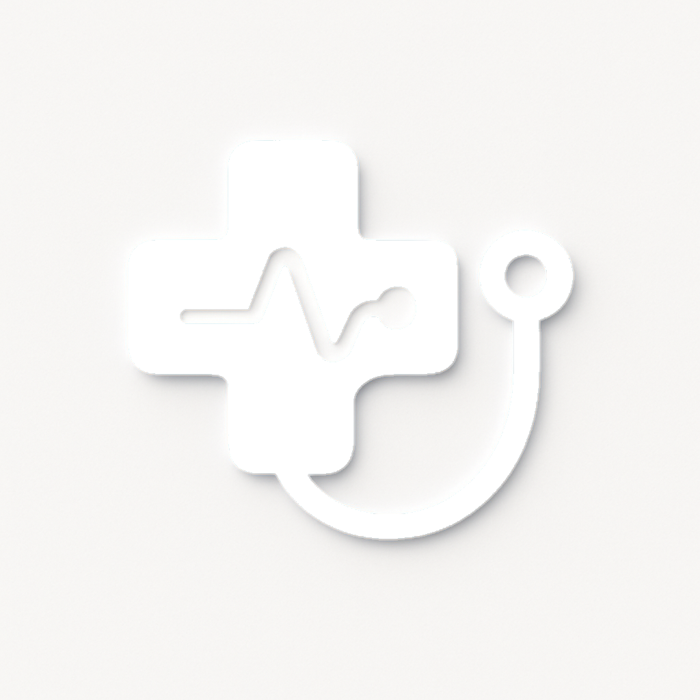

# DictaMed — Автоматизация медицинской документации для Казахстана



**DictaMed** — это инновационная платформа SaaS, которая помогает врачам Казахстана сократить время на заполнение медицинской документации с 50% до 10% рабочего дня. Платформа преобразует краткие заметки или голосовую диктовку в профессиональные медицинские протоколы формата SOAP с точностью 96%.

## 🎯 Ключевые особенности

- **Двуязычный интерфейс** — Полная поддержка русского и казахского языков
- **SOAP протоколы** — Автоматическая генерация медицинских документов
- **Голосовая диктовка** — Распознавание медицинской речи (интеграция с Яндекс SpeechKit)
- **Копирование в буфер обмена** — Быстрый экспорт протокола
- **Дизайн Neumorphism** — Современный, надежный интерфейс
- **Соответствие законодательству** — Закон РК № 94-V о защите персональных данных
- **Интеграция с МИС** — Поддержка Damumed, MedRecord, Almaty Medical

## 📊 Рыночные показатели

| Параметр | Значение |
|----------|----------|
| **Целевой рынок** | Казахстан (РК) |
| **Целевая аудитория** | Врачи частных клиник, амбулаторных центров |
| **Точность генерации** | 96% |
| **Сэкономленное время** | 40% рабочего дня |
| **Финансовый прогноз Year 1** | 159M ₸ |
| **Финансовый прогноз Year 2** | 594M ₸ |

## 💰 Тарифные планы

| План | Цена | Пользователи | Особенности |
|------|------|-------------|-----------|
| **Базовый** | 35,000 ₸/месяц | 1 врач | Неограниченные протоколы, базовая поддержка |
| **Клиника** | 150,000 ₸/месяц | До 10 врачей | Автоматический экспорт в МИС, приоритетная поддержка |
| **Enterprise** | 450,000 ₸/месяц | Неограниченно | Полная интеграция, API, dedicated manager |

## 🚀 Быстрый старт

### Требования

- Node.js 18.0+
- pnpm 10.4.1+ (или npm/yarn)
- Git

### Установка и запуск

```bash
# 1. Клонирование репозитория
git clone https://github.com/yourusername/dictamed.git
cd dictamed

# 2. Установка зависимостей
pnpm install

# 3. Запуск dev-сервера
pnpm dev

# 4. Открытие в браузере
# Перейдите на http://localhost:3000
```

### Сборка для production

```bash
# Сборка
pnpm build

# Запуск production-сборки
pnpm start

# Или preview
pnpm preview
```

## 📁 Структура проекта

```
dictamed/
├── client/                          # Фронтенд приложение
│   ├── public/
│   │   ├── images/                 # Изображения и иконки
│   │   └── index.html
│   ├── src/
│   │   ├── components/
│   │   │   ├── ui/                 # shadcn/ui компоненты
│   │   │   ├── ErrorBoundary.tsx
│   │   │   └── Map.tsx
│   │   ├── contexts/
│   │   │   ├── LanguageContext.tsx # RU/KK переключатель
│   │   │   └── ThemeContext.tsx
│   │   ├── pages/
│   │   │   ├── Home.tsx            # Главная страница
│   │   │   ├── Report.tsx          # Рыночный отчет
│   │   │   └── NotFound.tsx
│   │   ├── App.tsx                 # Главный компонент
│   │   ├── main.tsx
│   │   └── index.css               # Стили Neumorphism
│   └── tsconfig.json
├── server/                          # Backend (Express)
│   └── index.ts
├── shared/                          # Общие типы и константы
│   └── const.ts
├── package.json
├── vite.config.ts
├── tailwind.config.ts
├── TECHNICAL_DOCUMENTATION.md       # Техническая документация
├── COMPLETE_PROJECT_EXPORT.md       # Полный экспорт проекта
├── DictaMed_Final_Business_Plan_RU.pdf  # Бизнес-план
└── README.md                        # Этот файл
```

## 🛠 Технологический стек

### Фронтенд
- **React 19.2.1** — Фреймворк
- **TypeScript 5.6.3** — Типизация
- **Tailwind CSS 4.1.14** — Стилизация
- **Vite 7.1.7** — Сборщик
- **Wouter 3.3.5** — Маршрутизация
- **shadcn/ui + Radix UI** — UI компоненты
- **Sonner 2.0.7** — Уведомления
- **Lucide React 0.453.0** — Иконки

### Backend
- **Express 4.21.2** — Веб-сервер
- **Node.js 18+** — Runtime

### Тестирование и разработка
- **Vitest 2.1.4** — Тестирование
- **Prettier 3.6.2** — Форматирование
- **ESBuild 0.25.0** — Bundler

## 📖 Документация

- **[TECHNICAL_DOCUMENTATION.md](TECHNICAL_DOCUMENTATION.md)** — Полная техническая документация с инструкциями по запуску, архитектурой, решением проблем
- **[COMPLETE_PROJECT_EXPORT.md](COMPLETE_PROJECT_EXPORT.md)** — Полный экспорт проекта с исходным кодом всех компонентов
- **[DictaMed_Final_Business_Plan_RU.pdf](DictaMed_Final_Business_Plan_RU.pdf)** — Бизнес-план для инвесторов и Astana Hub

## 🌍 Языковая поддержка

DictaMed поддерживает два языка:

- **Русский (RU)** — Полная поддержка
- **Казахский (KK)** — Полная поддержка

Переключение языков доступно через кнопку в заголовке приложения.

## 🔐 Безопасность и соответствие

DictaMed полностью соответствует казахстанскому законодательству:

- **Закон РК № 94-V** — О защите персональных данных и информации
- **Приказ МЗ РК № ҚР ДСМ-175/2020** — Стандарты ведения электронной медицинской карты
- **ГОСТ 28147-89** — Шифрование данных
- **TLS 1.2+** — Безопасная передача данных
- **AES-256** — Шифрование в покое

Все данные пациентов локализованы на серверах в Казахстане и защищены в соответствии с требованиями закона.

## 📈 Product Roadmap

### Phase 1 (Q1-Q2 2024) — MVP ✅
- Веб-приложение с SOAP генератором
- Двуязычный интерфейс
- Копирование в буфер обмена

### Phase 2 (Q3-Q4 2024)
- Chrome-расширение для экспорта в Damumed
- Интеграция с Яндекс SpeechKit
- Мобильное приложение (iOS/Android)

### Phase 3 (2025)
- AI диагностика с использованием GPT-4
- Телемедицина и видеоконсультации
- Аналитика и отчеты для клиник

### Phase 4 (2025-2026)
- Интеграция с государственной системой здравоохранения
- Поддержка МКБ-10 кодирования
- Расширение на другие страны СНГ

## 🤝 Партнеры и интеграции

DictaMed интегрируется с ведущими казахстанскими системами:

- **Damumed** — Наиболее распространенная МИС в Казахстане
- **MedRecord** — Система управления медицинскими записями
- **Almaty Medical System** — Система для частных клиник

Целевые партнеры для расширения:
- Medical Park (15+ клиник)
- Invivo (12+ клиник)
- Keruen (10+ клиник)
- Euromed (8+ клиник)
- Acibadem (6+ клиник)

## 💡 Уникальные преимущества

1. **Поддержка медицинского казахского языка** — Первое решение на рынке с полной поддержкой казахского
2. **Интеграция с локальными стандартами** — Соответствие Приказу МЗ РК № ҚР ДСМ-175/2020
3. **Соответствие казахстанскому законодательству** — Полная локализация данных и шифрование
4. **Интеграция с казахстанскими МИС** — Поддержка Damumed, MedRecord, Almaty Medical

## 📞 Контакты

- **Email:** support@dictamed.kz
- **Веб-сайт:** https://dictamed.kz
- **Телефон:** +7 (727) XXX-XX-XX
- **GitHub:** https://github.com/yourusername/dictamed

## 📄 Лицензия

MIT License — см. файл [LICENSE](LICENSE)

## 👨‍💻 Разработано

**Manus AI** — Автономный AI агент для разработки и бизнеса

---

## 🚀 Развертывание

### На Manus
1. Создайте checkpoint
2. Нажмите кнопку "Publish" в Management UI
3. Приложение будет доступно по адресу: `https://dictamed.manus.space`

### На Vercel
```bash
npm i -g vercel
vercel
```

### На Netlify
```bash
npm i -g netlify-cli
netlify deploy --prod --dir=dist
```

### На Docker
```bash
docker build -t dictamed .
docker run -p 3000:3000 dictamed
```

---

**Версия:** 1.0  
**Статус:** Готово к развертыванию  
**Дата:** 31 декабря 2025
